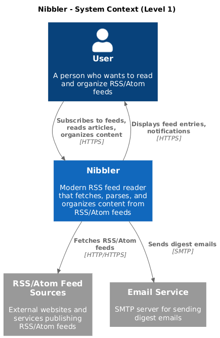
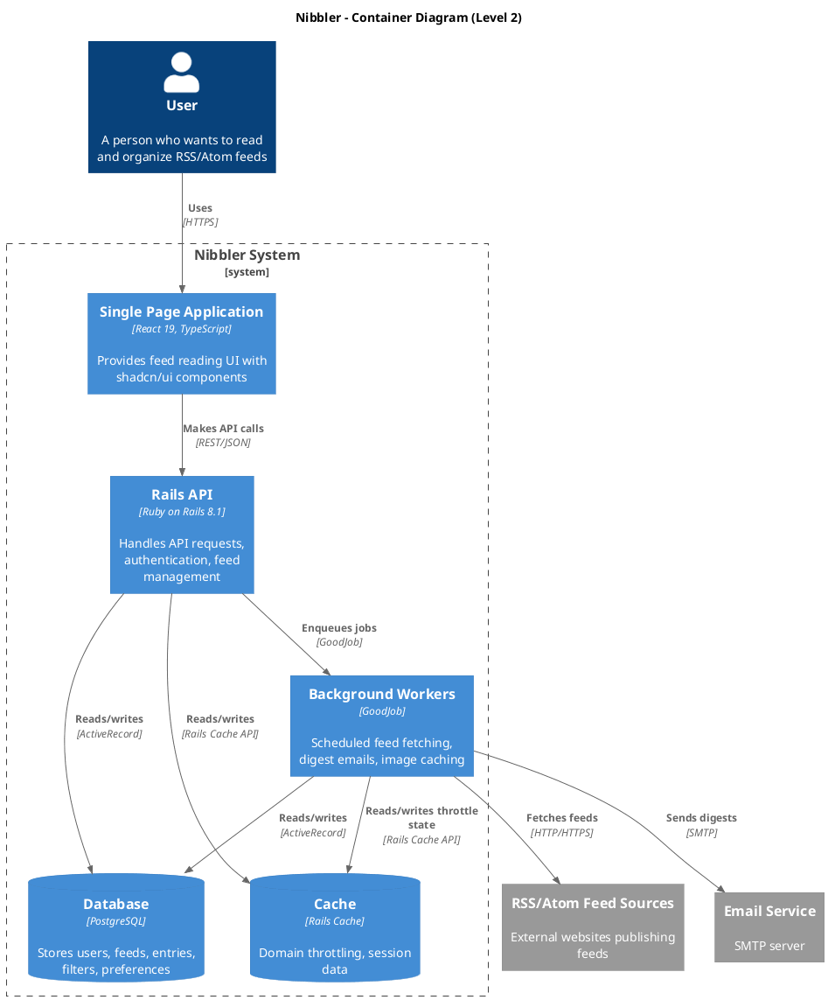
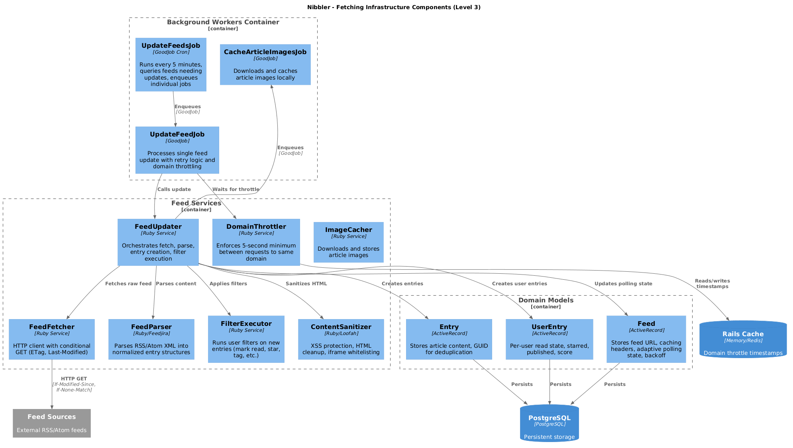
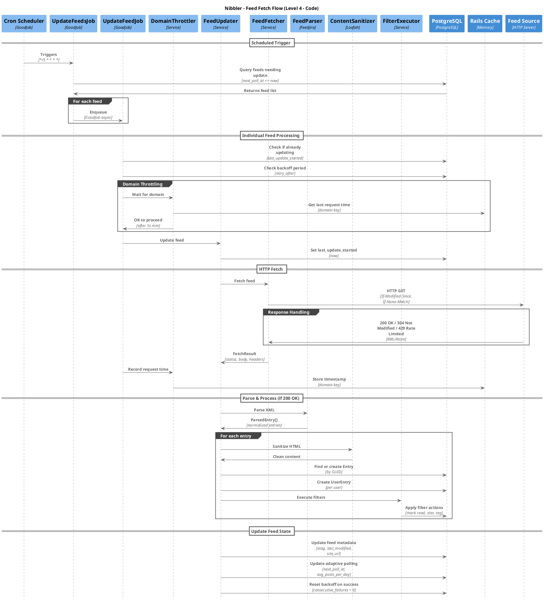

# Nibbler Architecture

C4 model architecture diagrams for Nibbler, an RSS feed reader.

## Level 1: System Context

Shows Nibbler in its environment with users and external systems.

## Level 2: Container Diagram

Shows the high-level technical building blocks: React frontend, Rails API, background workers, and data stores.

## Level 3: Component Diagram - Fetching Infrastructure

Shows the internal components responsible for fetching, parsing, and processing RSS/Atom feeds.

## Level 4: Sequence Diagram - Feed Fetch Flow

Shows the time-ordered flow of a scheduled feed update, from cron trigger through HTTP fetch, parsing, entry creation, and filter execution.

